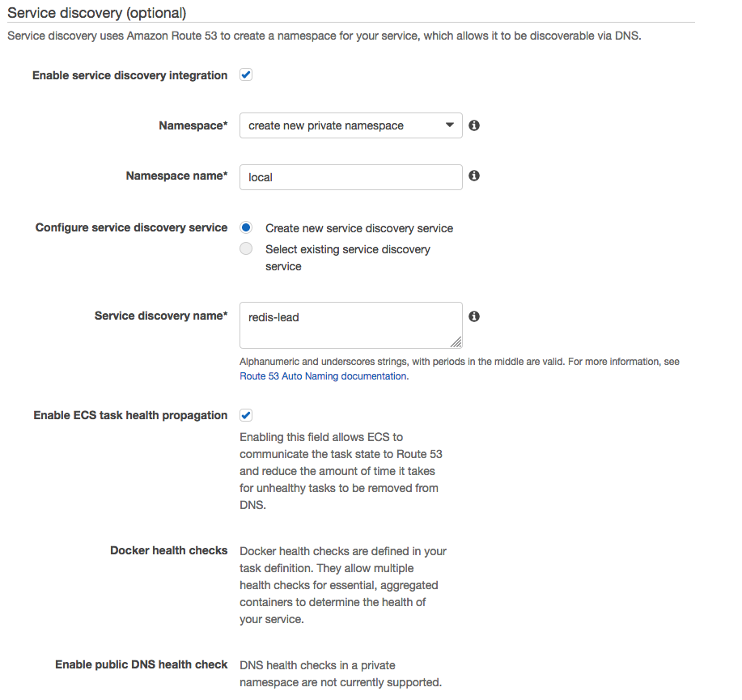

## Practical Fargate
Twitter: [@ric__harvey](https://twitter.com/ric__harvey)
### Take aways

By the end of this lab session you'll have seen built a full VPC and an AWS Fargate cluster. Into this cluster you'll learn how to deploy a container service whilst using service discovery.

### What is Fargate
URL: [https://aws.amazon.com/fargate/](https://aws.amazon.com/fargate/)

AWS Fargate is a technology for Amazon ECS that allows you to run containers without having to manage servers or clusters. With AWS Fargate, you no longer have to provision, configure, and scale clusters of virtual machines to run containers. This removes the need to choose server types, decide when to scale your clusters, or optimize cluster packing. AWS Fargate removes the need for you to interact with or think about servers or clusters. Fargate lets you focus on designing and building your applications instead of managing the infrastructure that runs them.

Another bonus to Fargate is that apart from no infrastructure to manage you are charged only for the resources your container consumes and not a full EC2 instance.

Checkout: [https://aws.amazon.com/fargate/pricing/](https://aws.amazon.com/fargate/pricing/) for more details

### Requirements

- AWS account
- AWS CLI installed + configured with your API keys
- Git CLI installed

### Expected time

You should be able to deploy this in 30-45 mins

### Solution overview

We are going to use the AWS technologies listed below to build a simple chat application that uses redis to pass messages between the frontends. When we build the components we'll use cloudformation however when we deploy the redis solution we'll build the "service" definition by hand in order to highlight how you can utilise the service discovery.

Products used:

- AWS Fargate
- Amazon CloudFormation
- AWS Application Discovery Service

##### High level overview diagram


## Exercise

### Getting started

##### Build the VPC

First we are going to need a VPC into which we'll deploy our Fargate Cluster. We are going to use cloudformation and deploy three public subnets and three private subnets, our fargate cluster will be in the private subnet and we'll use load balancers to make this publicly accessible.

In this git repository there is a folder called cloudformation. This contains our files for building our VPC.

Open the AWS console in your browser and go to cloudformation. Press Create Stack.


Select upload template to S3 and find the file named **_public-private-vpc.yml_**


Answer a few questions such as stack name and set your Environment variable. This variable needs to be the same in the next two templates. In the demo that goes with this I use **_dev_** as the environment name and we need to use the same name in all other stacks.

Wait for this to complete in the console.

##### Cluster creation

We now need to create our fargate cluster name space. Note there are no running instances in EC2 but we still have a cluster in the ECS console. Our cloudformation stack is also going to create two load balancers, a public and a private ALB. In this demo we'll only use the public one.

Press Create Stack again and upload the **_fargate-cluster.yml_** file. Once complete head over to the ECS console and you'll see your newly created cluster.

Remember our environment in this is called dev so update that variable as you go along.


### Create the Redis master and service definition

Lets now create a redis container in our fargate cluster. Open the cloudformation console and load the **_redis-master.yml_** template.

Take a look in the ECS console and under Task Definitions you should now see defined a new task called redis-master. Check the tick box and under actions choose **_Create Service_**.


Now set the inital options for the service:


Choose:

- **Launch Type**: Fargate
- **Number of Tasks**: 1

The rest can remain default. The next section you'll be ask about is networking:


Make sure you select the following options:

- **Cluster VPC**: dev-vpc (subnet should be 10.0.0.0/16)
- **Subnets**: 10.0.3.0/24, 10.0.4.0/24, 10.0.5.0/24

and next we need to edit the security group:


Change the type from **_HTTP_** to **_custom TCP_** and set the port to 6379. In this demo I've allowed access from everywhere for ease and speed but in a real deployment you'd lock this down, luckily its in the private subnet so none routable from the internet.

Set:

- **_Auto-assign public IP_**: disabled

Now for some service discovery so our chat application can locate the redis master, via a DNS name rather than hardcoding an IP.



The defaults are good to go. What this will do is create a .local DNS zone in Amazon Route 53

The only change you need to make is to drop the TTL for the A record to at most 3 seconds. When setting this value consider, if that service was to fail and be replaced with a container with a new IP the TTL is downtime till the new version propagates.


Click Next, next, create service.

Now the service is created, you can check out the status of the running container in the ECS console. Its also work noting if you look in EC2 you wont see any running instances. To check out the DNS do this by going to Route 53 and looking for the **_local_** zone. In here you should see the record **_redis-master.local._** which you'll see has a private IP in one of the ranges 10.0.{3-5}.0/24

### Create the chat application

Finally lets create the application. In cloudformation load the **_chat-service.yml_** template. This stack creates the TASK and the SERVICE this time so all you have to do make sure you select the right environment. We will create 3 copies of our chat application (TASK) and link it to the ALB. If you check out the code yaml you'll notice there is a section to give the ALB a nice public DNS name also.

**NOTE:** Give a few mins for the DNS to propagate before trying to browse to it.

Once the stack completes, head to the ECS console and you'll see in your cluster you have 2 services and 4 running tasks. Thats because the redis service has 1 copy and the chat-service has 3 copies of the task.

### Testing

Load your favourite web browser and find the FQDN for the public ALB created. This can be found in the EC2 console under load balancers. Head to the URL and type in your name, you can then start chatting.


### Summary

In summary, you've now successfully built a Fargate cluster, loaded a task definition and built a service by hand. For that service you've also enabled service discovery so our chat service can use the redis instance. Plus you've done all this without spinning up and configuring any servers!

### Clean up

Most of this can be deleted by deleting the stack in the cloudformation console. However you'll need to manually pull down the service discovery component as we built this by hand.

First lets delete the service from in the ECS console. Find ther redis master service in your cluster and select it then hit delete:


Now you can confirm deletion by typing **_delete me_**


Lets now use the aws CLI to clean up the service discovery elements. Let's find the service and namespace we need to clean up.

```bash
$ aws servicediscovery list-namespaces

{
    "Namespaces": [
        {
            "Id": "ns-orjxhzxsj7yk7ocm",
            "Arn": "arn:aws:servicediscovery:eu-west-1:210944566071:namespace/ns-orjxhzxsj7yk7ocm",
            "Name": "local",
            "Type": "DNS_PRIVATE"
        }
    ]
}
```

```bash
$ aws servicediscovery list-services

{
    "Services": [
        {
            "Id": "srv-a66t7vfsvb37jnhi",
            "Arn": "arn:aws:servicediscovery:eu-west-1:210944566071:service/srv-a66t7vfsvb37jnhi",
            "Name": "redis-master"
        }
    ]
}
```

Then delete the service first and lastly the namespace:

```bash
$ aws servicediscovery delete-service --id srv-a66t7vfsvb37jnhi
$ aws servicediscovery delete-namespace --id ns-orjxhzxsj7yk7ocm
```

### What next?

Some ideas:

If you want to take this to the next level, try creating a clustered redis service or making the chat front end autoscale. Another good thing to experiment with is adding IAM roles to your tasks.
